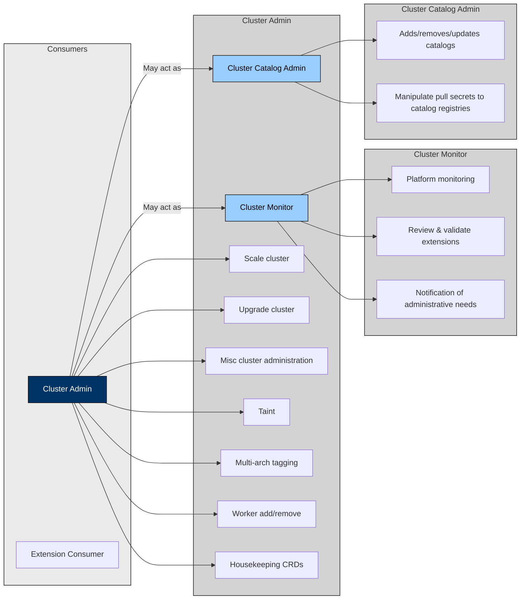
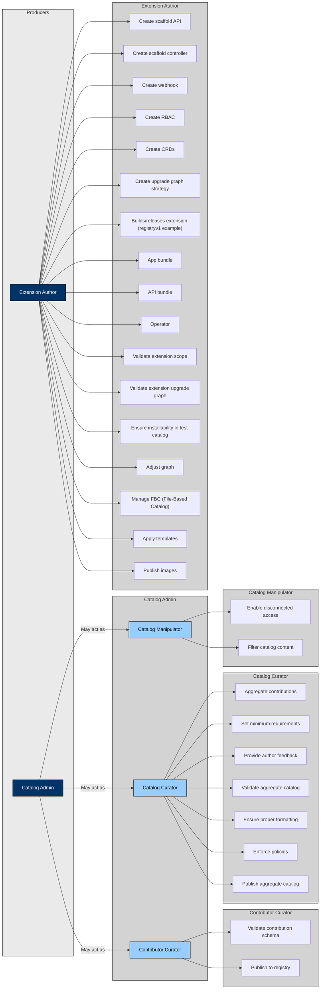

## Personas and Roles in OLM

To map the **personas** and **roles** interacting with **OLM**, the following diagrams were created. These personas represent different users who interact with OLM, either by consuming or producing content.

The personas are grouped into:
- **Consumers** – Users who consume or interact with the content managed by OLM.
- **Producers** – Users who produce content for OLM, including cluster extensions or catalogs.

## Overview of Personas:

### **Consumers:**
- **Cluster Admin** – Responsible for cluster-wide administration. May also act as:
   - **Cluster Monitor** – Focuses on platform monitoring and validation of extensions.
   - **Cluster Catalog Admin** – Manages and maintains catalogs within the cluster.
- **Cluster Extension Consumer** – Primarily interacts with and consumes content from catalogs.

### **Producers:**
- **Catalog Admin** – Oversees catalog management. May also act as:
   - **Contributor Curator** – Manages content contributions and validation.
   - **Catalog Curator** – Ensures compliance, formatting, and aggregation of contributions.
   - **Catalog Manipulator** – Handles catalog modifications, including filtering and disconnected access.
- **Extension Author** – Develops, validates, and releases cluster extensions.

The following sections provide a more detailed breakdown of each persona, including their roles and responsibilities.

## **Detailed Breakdown of Each Persona with Example Responsibilities**

### Consumers

1. **Cluster Admin**
   - May serve as:
      - Cluster Monitor
      - Cluster Catalog Admin
   - Responsibilities:
      - Scale cluster
      - Upgrade cluster
      - Miscellaneous cluster administration
      - Apply taints
      - Multi-arch tagging
      - Add/remove workers
      - Housekeeping CRDs

2. **Cluster Monitor** (Sub-role of Cluster Admin)
   - Responsibilities:
      - Platform monitoring
      - Extension monitoring
      - Notification of administrative needs

3. **Cluster Catalog Admin** (Sub-role of Cluster Admin)
   - Responsibilities:
      - Add, remove, and update catalogs
      - Manipulate pull secrets for catalog registries

4. **Extension Consumer**
   - Responsibilities:
      - Create service accounts and support infrastructure for extension lifecycle
      - Install extensions
      - Upgrade extensions
      - Remove extensions
      - View available extensions in catalog
      - Browse catalog
      - Derive minimum privilege for installation
      - Filter visibility on installable extensions
      - Observe the health of installed extensions

---

### Producers

1. **Catalog Admin**
   - May serve as:
      - Contributor Curator
      - Catalog Curator
      - Catalog Manipulator

2. **Contributor Curator** (Sub-role of Catalog Admin)
   - Responsibilities:
      - Validate contribution schema
      - Publish content to the registry

3. **Catalog Curator** (Sub-role of Catalog Admin)
   - Responsibilities:
      - Aggregate contributions
      - Set minimum requirements
      - Provide feedback to authors
      - Validate aggregate catalog
      - Ensure proper formatting
      - Enforce policies
      - Publish aggregate catalog

4. **Catalog Manipulator** (Sub-role of Catalog Admin)
   - Responsibilities:
      - Enable disconnected access
      - Filter catalog content

5. **Extension Author**
   - Responsibilities:
      - Create scaffold API
      - Create scaffold controller
      - Create webhook
      - Create RBAC (Role-Based Access Control)
      - Create CRDs (Custom Resource Definitions)
      - Create upgrade graph strategy
      - Build and release extensions (registry v1 example)
      - Develop app bundle
      - Develop API bundle
      - Develop operator
      - Validate extension scope
      - Validate extension upgrade graph
      - Ensure installability in test catalog
      - Adjust graph
      - Manage FBC (File-Based Catalog)
      - Apply templates
      - Publish images

