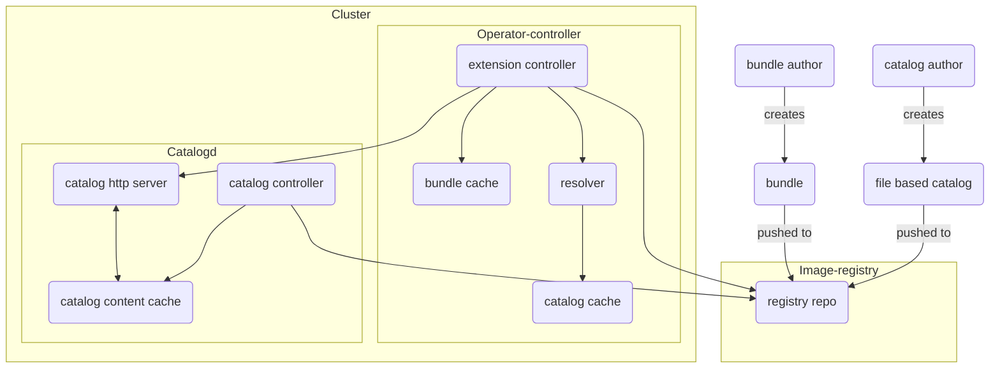

## OLM V1 Architecture

This document describes the OLM v1 architecture. OLM v1 consists of two main components:

* [operator-controller](https://github.com/operator-framework/operator-controller)
* [catalogD](https://github.com/operator-framework/catalogd)

The diagram below illustrates the OLM v1 architecture and its components,  and the following sections describe each of the components in detail.

### Diagram

**Note**: The direction of the arrow indicates the active part of communication i.e. if arrow starts from A and points to B that means A consumes the information from B unless specifically mentioned.

### Operator-controller:

operator-controller is the central component of OLM v1. It is responsible:
 * managing a cache of catalog metadata provided by catalogd through its HTTP server
 * keeping the catalog metadata cache up-to-date with the current state of the catalogs
 * locating the right `registry+v1` bundle, if any,  that meet the constraints expressed in the `ClusterExtension` resource, such as package name, version range, channel, etc. given the current state of the cluster
 * unpacking the bundle
 * applying the bundle manifests: installing or updating the content.
 
 It has three main sub-components:
 * Cluster Extension Controller: 
    * Queries the catalogd (catalogd HTTP Server) to get catalog information.
    * Once received the catalog information is saved  to catalog-cache. The cache will be updated automatically if a Catalog is noticed to have a different resolved image reference. 
    * Reaches out to the registry to download the bundle container images, saves it to the bundle cache,  unpacks it and applies the bundle manifests to the cluster.  
    * It is also Responsible for figuring out which bundle to upgrade
 * Resolver:
    * Helps the cluster extension controller to filter the bundle reference after applying the user restrictions (e.g. name, priority etc) and returns the bundle reference to the extension controller.
 * Bundle Cache:
    * Bundle cache returns the cache for the bundle. If a cache does not already exist, a new one will be created.

### Catalogd:

Catalogd unpacks [file-based catalog (FBC)](https://olm.operatorframework.io/docs/reference/file-based-catalogs/#docs) content that is packaged and shipped in container images, for consumption by clients on-clusters (unpacking from other sources, like git repos, OCI artifacts etc, are in the roadmap for catalogD). It serves the extension metadata, provided by the extension authors, found in the FBC, making it possible for on-cluster clients to discover installable content.

* Catalogd can be broken down in to three sub-components i.e. ClusterCatalog controller, catalogd http server, catalogd content cache.
* Catalog controller  is responsible for pulling FBC based catalog images from registry and unpacking them into the catalog content cache. It is also responsible for reconciling the latest changes in the cluster catalog.
* Catalogd http server is responsible for serving catalog information to clients e.g. cluster extension controller.
* Catalogd content cache is maintained by the catalog controller and used by the catalogd http server to answer queries from clients.

