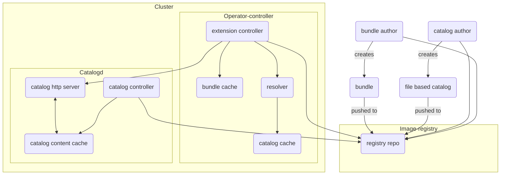

## OLM V1 Architecture

This document talks about the V1 architecture. OLM V1 consists of many components, however majority of the code is divided in to two components

* [operator-controller](https://github.com/operator-framework/operator-controller)
* [catalogD](https://github.com/operator-framework/catalogd)

The below diagram and text explains the sub-components within each code repository and how they related to each-other.

### Operator-controller:

operator-controller is the central component of OLM v1, that consumes all of the components below to extend Kubernetes to allows users to install, and manage the lifecycle of other extensions

* Operator-controller queries the catalogd (catalogd HTTP Server) to get catalog information.  Once received the catalog information is saved  to catalog-cache. The cache will be updated automatically if a Catalog is noticed to have a different resolved image reference.
* Resolver in operator-controller helps the extension controller to filter the bundle reference after applying the user restrictions (e.g. name, priority etc) and returns the bundle reference to the extension controller.
* Cluster extension controller reaches out to the registry to download the bundle container images, saves it to the bundle cache,  unpacks it and applies the bundle manifests to the cluster.  It is also Responsible for figuring out which bundle to upgrade.
* Bundle cache returns the cache for the bundle. If a cache does not already exist, a new one will be created.

### Catalogd:

Catalogd unpacks [file-based catalog (FBC)](https://olm.operatorframework.io/docs/reference/file-based-catalogs/#docs) content that is packaged and shipped in container images, for consumption by clients on-clusters (unpacking from other sources, like git repos, OCI artifacts etc, are in the roadmap for catalogD). As component of the Operator Lifecycle Manager (OLM) v1 microservices architecture, catalogD hosts metadata for Kubernetes extensions packaged by the authors of the extensions, as a result helping customers discover installable content.

* Catalogd can be broken down in to three sub-components i.e. ClusterCatalog controller, catalogd http server, catalogd content cache.
* Catalog controller  is responsible for pulling FBC based catalog images from registry and unpacking them into the catalog content cache. It is also responsible for reconciling the latest changes in the cluster catalog.
* Catalogd http server is responsible for serving catalog information to clients e.g. cluster extension controller.
* Catalogd content cache is maintained by the catalog controller and used by the catalogd http server to answer queries from clients.

### Diagram

**Note**: The direction of the arrow indicates the active part of communication i.e. if arrow starts from A and points to B that means A consumes the information from B unless specifically mentioned.
