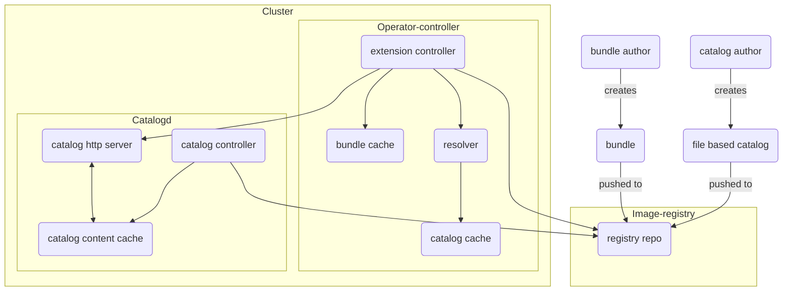

---
hide:
  - toc
---

## OLM v1 Architecture

This document provides an overview of the architecture of OLM v1, which consists of two primary components:

1. [operator-controller](https://github.com/operator-framework/operator-controller)
2. [catalogD](https://github.com/operator-framework/operator-controller/tree/main/catalogd)

The diagram below visually represents the architecture of OLM v1, followed by descriptions of each component and its role within the system.

### Architecture Diagram

!!! note
    The direction of the arrows represents the flow of communication. If an arrow starts from A and points to B, it indicates that A retrieves or consumes information from B, unless otherwise specified.

---

### operator-controller

The `operator-controller` is the core component of OLM v1. Its responsibilities include:

- Managing a cache of catalog metadata provided by catalogD through its HTTP server.
- Ensuring the catalog metadata cache is kept up-to-date with the latest catalog state.
- Identifying the appropriate `registry+v1` bundle that meets the constraints defined in the `ClusterExtension` resource (e.g., package name, version, channel) based on the cluster's current state.
- Unpacking and applying bundle manifests (e.g., installing or updating the operator).

The operator-controller has three key sub-components:

1. **Cluster Extension Controller**:
    - Queries catalogD (via its HTTP server) to retrieve catalog information.
    - Saves catalog information in the catalog cache and automatically updates the cache if a catalog has a new image reference.
    - Downloads bundle container images from the registry, saves them to the bundle cache, unpacks them, and applies the bundle manifests to the cluster.
    - Handles bundle upgrades by determining which bundle is the correct one to apply.

2. **Resolver**:
    - Assists the Cluster Extension Controller by filtering bundle references according to user-defined restrictions (e.g., package name, priority). It returns the filtered bundle reference to the extension controller.

3. **Bundle Cache**:
    - Stores previously unpacked bundles. If a bundle is not already cached, it downloads and caches it for future use.

---

### catalogd

catalogd is responsible for unpacking [file-based catalog (FBC)](https://olm.operatorframework.io/docs/reference/file-based-catalogs/#docs) content, which is packaged and delivered as container images. It allows on-cluster clients to discover installable content by providing access to this metadata. In the future, catalogD will also support other sources like Git repositories and OCI artifacts.

catalogd has three main sub-components:

1. **ClusterCatalog Controller**:
    - Pulls FBC-based catalog images from the registry and unpacks them into the catalog content cache.
    - Reconciles any changes in the catalog and ensures the latest content is reflected in the cluster.

2. **CatalogD HTTP Server**:
    - Serves catalog information to clients, such as the Cluster Extension Controller.

3. **CatalogD Content Cache**:
    - A cache maintained by the Catalog Controller that stores unpacked catalog data, which the CatalogD HTTP Server uses to respond to client queries.
