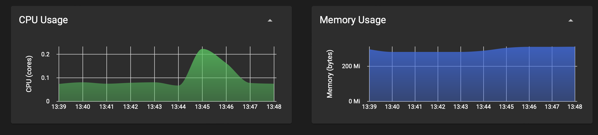

## pprof

> **Warning**
> This pprof data is based on early versions of catalogd and has not been updated since. The data is likely not accurate anymore.
> A decision about removing or updating this data will be made in the future. 

This folder contains some profiles that can be read using [pprof](https://github.com/google/pprof) to show how the core kubernetes apiserver and the custom catalogd apiserver CPU & Memory utilization is affected by the creation and reconciliation of the sample `Catalog` CR found at `../config/samples/core_v1_clustercatalog.yaml`.

Instead of providing static screenshots and losing the interactivity associated with these `pprof` profiles, each of the files with the extension `.pb` can be used to view the profiles that were the result of running `pprof` against the live processes.

To view the `pprof` profiles in the most interactive way (or if you have no prior `pprof`experience) it is recommended to run:
```
go tool pprof -http=localhost:<port> somefile.pb
```

This will start up an interactive web UI for viewing the profile data for a specific file on `localhost:<port>`. There are quite a few different ways this data can be viewed so feel free to play around and find the view which gives you the most meaningful information.

If you know your way around `pprof` you *should* be able to run any other variations of `pprof` with these files as well.

Here is a brief breakdown of what information is provided in each profile file in this directory:
- `kubeapiserver_cpu_profile.pb` - This is the CPU utilization of the core kube-apiserver
- `kubeapiserver_heap_profile.pb` - This is the Memory utilization of the core kube-apiserver
- `catalogd_apiserver_cpu_profile.pb` - This is the CPU utilization of the custom catalogd apiserver
- `catalogd_apiserver_heap_profile.pb` - This is the Memory utilization of the custom catalogd apiserver
- `manager_cpu_profile.pb` - This is the CPU utilization of the Catalog controller (and other controllers associated with this manager).
- `manager_heap_profile.pb` - This is the Memory utilization of the Catalog controller (and other controllers associated with this manager).
- `kubeapiserver_alone_cpu_profile.pb` - This is the CPU utilization for the core kube-apiserver without running our custom apiserver
- `kubeapiserver_alone_heap_profile.pb` - This is the Memory utilization for the core kube-apiserver without running our custom apiserver

> **NOTE**: All profiles were collected ASAP after all child resources were created from the reconciliation of the sample `Catalog` CR.


## Pprof Breakdown
In this section, we will break down the differences between how the core kube-apiserver resource utilization was impacted when running with and without the custom catalogd apiserver in an effort to determine how beneficial it is to use a custom apiserver.

> **NOTE**: All this information was compared by someone who is not very experienced with using `pprof`. If you find that any of these values are incorrect or the calculations don't seem to make sense, feel free to create an issue or open a PR to update these findings.

### CPU Utilization

| Metric  | kube-apiserver alone | kube-apiserver w\custom | Normalized Difference |
| ------- | -------------------- | ----------------------- | --------------------- |
| cpu     | 1.72s / 30s (5.73%)  | 1.99s / 30.06s (6.62%)  | 1720ms / 60.06s (2.86%) |

The `Normalized Difference` Metric was evaluated by running:
```
go tool pprof -http=localhost:6060 -diff_base=pprof/kubeapiserver_alone_cpu_profile.pb -normalize pprof/kubeapiserver_cpu_profile.pb
```
This command will normalize the profiles to better compare the differences. In its simplest form this difference was calculated by `pprof/kubeapiserver_alone_cpu_profile.pb - pprof/kubeapiserver_cpu_profile.pb`

According to the `Normalized Difference`, there appears to be little to no difference in the amount of time the CPU is utilized (almost 0).

### Memory Utilization

| Metric        | kube-apiserver alone | kube-apiserver w\custom | Normalized Difference |
| ------------- | -------------------- | ----------------------- | --------------------- |
| inuse_space   | 126.85MB             | 139.67MB                | -0.02kB, 1.7e-05% of 129891.07kB total |
| inuse_objects | 721278               | 640819                  | -9, 0.0012% of 721278 total |
| alloc_space   | 1924.76MB            | 3455.75MB               | 0, 2e-07% of 1970951.57kB total |
| alloc_objects | 19717785             | 33134306                | 102, 0.00052% of 19717785 total |

The `Normalized Difference` Metric was evaluated by running:
```
go tool pprof -http=localhost:6060 -diff_base=pprof/kubeapiserver_alone_heap_profile.pb -normalize pprof/kubeapiserver_heap_profile.pb
```
This command will normalize the profiles to better compare the differences. In its simplest form this difference was calculated by `pprof/kubeapiserver_alone_heap_profile.pb - pprof/kubeapiserver_heap_profile.pb`

According to the `Normalized Difference`, there appears to be:
- An additional 0.02kB space used when in combination with the custom catalogd apiserver
- An additional 9 objects used when in combination with the custom catalogd apiserver
- No additional space allocated when in combination with the custom catalogd apiserver
- 102 less objects allocated when in combination with the custom catalogd apiserver


## Metric Server Analysis
This section will be an analysis of the on cluster CPU/Memory consumption of the pods corresponding to the core kube-apiserver, catalogd apiserver and the controller-manager.

This section is being added as the pprof metrics don't necessarily show the whole picture. This section will include 2 scenarios for the core kube-apiserver:
1. The CPU/Memory consumption of the kube-apiserver pod without the catalogd apisver running
2. The CPU/Memory consumption of the kube-apiserver pod with the catalogd apisever running

### Core kube-apiserver without catalogd apiserver


**TLDR**: CPU utilization spike of 0.156 cores and settles ~0.011 cores above prior utilization. Memory consumption increase of 22Mi.

This image shows the spike in CPU utilization and the increase in Memory consumption. In this scenario, the command:
```
kubectl apply -f config/samples/core_v1_clustercatalog.yaml
```
was run right at 1:44 PM.

The CPU spike lasted ~3 minutes and the values were:
- 1:44PM - 0.067 cores
- 1:45PM (PEAK) - 0.223 cores
- 1:47PM - 0.078 cores

With this, we can see that without the catalogd apiserver the core kube-apiserver had a CPU utilization spike of 0.156 cores and then settled at ~0.011 cores above what the utilization was prior to the reconciliation of the sample `Catalog` CR. 

The memory consumption increased over the span of ~3 minutes and then stabilized. The values were:
- 1:44PM - 289Mi
- 1:45PM - 305Mi
- 1:47PM - 311Mi

With this, we can see that without the catalogd apiserver the core kube-apiserver had a memory consumption increase of 22Mi.

### Core kube-apiserver with catalogd apiserver

#### kube-apiserver:


**TLDR**: CPU utilization spike of 0.125 cores and settles ~0.001 cores above prior utilization. Memory consumption increase of ~26Mi.

This image shows the spike in CPU utilization and the increase in Memory consumption. In this scenario, the command:
```
kubectl apply -f config/samples/core_v1_clustercatalog.yaml
```
was run right at 3:06 PM

The CPU spike lasted ~3 minutes and the values were:
- 3:06PM - 0.09 cores
- 3:07PM - 0.109 cores
- 3:08 PM (PEAK) - 0.215 cores
- 3:09 PM - 0.091 cores

With this, we can see that with the catalogd apiserver the core kube-apiserver had a CPU utilization spike of 0.125 cores and then settled at ~0.001 cores above what the utilization was prior to the reconciliation of the sample `Catalog` CR. 

The memory consumption increased over the span of ~3 minutes and then stabilized. The values were:
- 3:06PM - 337Mi
- 3:07PM - 361Mi
- 3:08 PM - 363Mi
- 3:09 PM - 363Mi

With this, we can see that with the catalogd apiserver the core kube-apiserver had a memory consumption increase of ~26Mi.

#### catalogd apiserver


**TLDR**: potential increase of ~0.012 cores, but more likely ~0.002 cores. Memory consumption increase of ~0.1Mi

This image shows the spike in CPU utilization and the increase in Memory consumption. In this scenario, the command:
```
kubectl apply -f config/samples/core_v1_clustercatalog.yaml
```
was run right at 3:06 PM

The CPU consumption increase lasted ~3 minutes and the values were:
- 3:06PM - 0.002 cores (there was a weird dip right here from ~0.012 cores at 3:05PM)
- 3:07PM - 0.01 cores
- 3:08 PM - 0.012 cores
- 3:09 PM - 0.014 cores

We can see that our custom apiserver had a CPU utilization increase of ~0.012 cores. If we take into consideration the weird dip and place the starting value at ~0.12 cores the CPU utilization increase is only ~0.002 cores.

The memory consumption increased over the span of ~3 minutes. The values were:
- 3:06PM - 77.9Mi
- 3:07PM - 77.9Mi
- 3:08 PM - 77.9Mi
- 3:09 PM - 78Mi (stable around this after)

We can see that our custom apiserver had a memory consumption increase of ~0.1Mi.

#### Summary
Comparing the results of the kube-apiserver running both with and without the catalogd apiserver, we can see that:
- The kube-apiserver CPU utilization spikes 0.031 cores less and settles ~0.01 cores less when running in combination with the catalogd apiserver
- The kube-apiserver consumes ~4Mi more memory when running in combination with the catalogd apiserver


Overall, when running both the kube-apiserver and the catalogd apiserver the total CPU utilization remains roughly the same while the overall memory consumption increases ~73Mi.

### controller-manager metrics


**TLDR**: CPU spike of 0.288 cores, settling ~0.003 cores above the previous consumption. Memory consumption of ~232.2Mi.

This image shows the spike in CPU utilization and the increase in Memory consumption. In this scenario, the command:
```
kubectl apply -f config/samples/core_v1_clustercatalog.yaml
```
was run right at 3:06 PM

The CPU spike lasted ~3 minutes and the values were:
- 3:06PM - 0.001 cores
- 3:07PM (PEAK) - 0.289 cores
- 3:08PM - 0.177 cores
- 3:09PM - 0.004 cores

We can see that the controller manager had a CPU utilization spike of 0.288 cores and then settled ~0.003 cores above the previous consumption. This is likely due to the large number of creation requests that needed to be made (~170 `Package` CR and ~1301 `BundleMetadata` CR creation requests).

The memory consumption increased over the span of ~3 minutes. The values were:
- 3:06PM - 49.8Mi
- 3:07PM - 248Mi
- 3:08PM - 282Mi
- 3:09PM - 282Mi

We can see that our controller-manager had a memory consumption increase of ~232.2Mi. This is likely due to the fact that the cache was populated with ~170 `Package` CRs and ~1301 `BundleMetadata` CRs.
