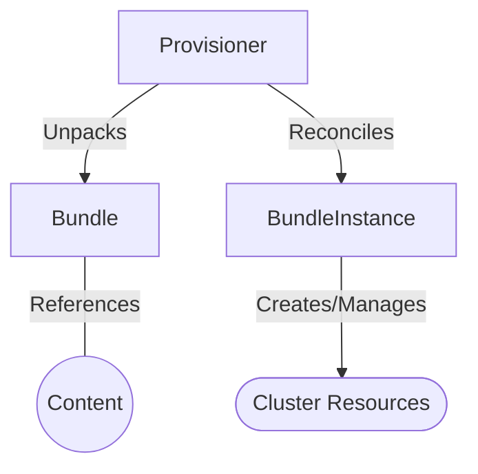

# RukPak

[](http://www.apache.org/licenses/LICENSE-2.0.html)
[](https://goreportcard.com/report/github.com/operator-framework/rukpak)
[](https://kubernetes.slack.com/archives/C038B7MF75M)

RukPak runs in a Kubernetes cluster and defines an API for installing cloud native bundle content.

## Introduction

RukPak is a pluggable solution for the packaging and distribution of cloud-native content and supports advanced
strategies for installation, updates, and policy. The project provides a content ecosystem for installing a variety of
artifacts, such as Git repositories, Helm charts, OLM bundles, and more onto a Kubernetes cluster. These artifacts can
then be managed, scaled, and upgraded in a safe way to enable powerful cluster extensions.

At its core, RukPak is a small set of APIs, packaged as Kubernetes CustomResourceDefinitions, and controllers that watch
for those APIs. These APIs express what content is being installed on-cluster and how to create a running instance of
the content.

## Contributing

The RukPak project is community driven and is part of the broader Kubernetes ecosystem. New contributors are welcome and
highly encouraged. See the [contributing guidelines](CONTRIBUTING.md) to get started.

This project uses GitHub issues and milestones to prioritize and keep track of ongoing work. To see the current state of
the project, checkout the [open issues](https://github.com/operator-framework/rukpak/issues) and
[recent milestones](https://github.com/operator-framework/rukpak/milestones).

## Getting Started

### Installation

The recommended way of installing RukPak is via a tagged release from
the [releases](https://github.com/operator-framework/rukpak/releases) page. There are detailed instructions provided in
the release notes on how to install a particular release. The only requirement is to have a `kubectl` client available
that is configured to target the cluster to install to.

> Note: RukPak depends on [cert-manager](https://cert-manager.io/) for creating and managing certificates for its webhooks.
cert-manager should be installed prior to installing RukPak. See the cert-manager [installation docs](https://cert-manager.io/docs/installation/)
for more information on how to install cert-manager.

It is recommended to install the latest release to access the latest features and new bugfixes. RukPak releases target
the linux operating system and support amd64, arm64, ppc64le, and s390x architectures via multi-arch images.

To install the latest release of RukPak, simply run:

```bash
kubectl apply -f https://github.com/operator-framework/rukpak/releases/latest/download/rukpak.yaml
```

Another installation option for developers interested in running RukPak locally is to clone the source code and deploy
RukPak to a local [kind](https://kind.sigs.k8s.io/) cluster.

```bash
git clone https://github.com/operator-framework/rukpak && cd rukpak
make run
```

> Note: RukPak may take some time to become fully operational while its controllers and webhooks are spinning up during installation. As a result, please allow a few moments before creating Bundles/BundleInstances if you are noticing unexpected failures.

There are currently no other supported ways of installing RukPak, although there are plans to add support for other
popular packaging formats such as a Helm chart or an OLM bundle.

### Quickstart

The RukPak project consists of a series of controllers, known as [provisioners](#provisioner), that install and manage
content on a Kubernetes cluster. See [below](#components) for a more detailed look into the APIs that RukPak provides.

The provisioner currently implemented and bundled with RukPak is known as the plain provisioner. To get started with
this provisioner on a local kind cluster,
see [the quickstart section](./internal/provisioner/plain/README.md#Running-locally) of the plain provisioner README. To
install the latest version of the provisioner on an existing cluster, see the [installation guide](#install). There will
be other provisioners added to the RukPak project that support different content types.

The plain provisioner is able to source and unpack plain bundles. To learn more about the plain bundle format,
see [the plain bundle spec](./docs/plain-bundle-spec.md).

## Components

RukPak is composed of two primary APIs, [Bundle](#bundle) and [BundleInstance](#bundleInstance), as well as the concept
of a [Provisioner](#provisioner). These components work together to bring content onto the cluster and install it,
generating resources within the cluster. Below is a high level diagram depicting the interaction of the RukPak
components.



A provisioner places a watch on both Bundles and BundleInstances that refer to it explicitly. For a given bundle, the
provisioner unpacks the contents of the Bundle onto the cluster. Then, given a BundleInstance referring to that Bundle,
the provisioner then installs the bundle contents and is responsible for managing the lifecycle of those resources.

### Bundle

A `Bundle` represents content that needs to be made available to other consumers in the cluster. Much like the contents
of a container image need to be pulled and unpacked in order for Pods to start using them,
`Bundles` are used to reference content that may need to be pulled and should be unpacked. In this sense, Bundle is a
generalization of the image concept, and can be used to represent any type of content.

`Bundles` do nothing on their own - they require a `Provisioner` to unpack and make their content available in-cluster.
They can be unpacked to any arbitrary storage medium such as a tar.gz file in a directory mounted into the provisioner
pods. Each `Bundle` has an associated `spec.provisionerClassName` field which indicates the `Provisioner` that should be
watching and unpacking that particular bundle type.

Example Bundle configured to work with the [plain provisioner](internal/provisioner/plain/README.md).

```yaml
apiVersion: core.rukpak.io/v1alpha1
kind: Bundle
metadata:
  name: my-bundle
spec:
  source:
    type: image
    image:
      ref: my-bundle@sha256:xyz123
  provisionerClassName: core.rukpak.io/plain
```

> Note: Bundles are considered immutable once they are created. See the [bundle immutability doc](/docs/bundle-immutability.md)
> for more information.

### BundleInstance

> :warning: A BundleInstance changes the state of the Kubernetes cluster by installing and removing objects. It's important
> to verify and trust the content that is being installed, and limit access (via RBAC) to the BundleInstance API to only those
> who require those permissions.

The `BundleInstance` API points to a Bundle and indicates that it should be “active”. This includes pivoting from older
versions of an active bundle.`BundleInstance` may also include an embedded spec for a desired Bundle.

Much like Pods stamp out instances of container images, `BundleInstances` stamp out an instance of
Bundles. `BundleInstance` can be seen as a generalization of the Pod concept.

The specifics of how an `BundleInstance` makes changes to a cluster based on a referenced `Bundle` is defined by the
`Provisioner` that is configured to watch that `BundleInstance`.

Example BundleInstance configured to work with the [plain provisioner](internal/provisioner/plain/README.md).

```yaml
apiVersion: core.rukpak.io/v1alpha1
kind: BundleInstance
metadata:
  name: my-bundle-instance
spec:
  provisionerClassName: core.rukpak.io/plain
  template:
    metadata:
      labels:
        app: my-bundle
    spec:
      source:
        type: image
        image:
          ref: my-bundle@sha256:xyz123
      provisionerClassName: core.rukpak.io/plain
```

### Provisioner

A Provisioner is a controller that understands `BundleInstance` and `Bundle` APIs and can take action.
Each `Provisioner` is assigned a unique ID, and is responsible for reconciling a `Bundle` and `BundleInstance` with
a `spec.provisionerClassName` that matches that particular ID.

For example, in this repository the [plain](internal/provisioner/plain/README.md) provisioner is implemented.
The `plain` provisioner is able to unpack a given `plain+v0` bundle onto a cluster and then instantiate it, making the
content of the bundle available in the cluster.

If you are interested in implementing your own provisioner, please see the
[Provisioner Spec [DRAFT]](docs/provisioner-spec.md), which describes the expectations of provisioner implementations.

### CustomResourceDefinition (CRD) Validator

RukPak comes with a webhook for validating the upgrade of CRDs from `Bundle`s. If a CRD does potentially destructive
actions to the cluster, it will not allow it to be applied. In the context of RukPak, this will result in a failed
`BundleInstance` resolution.

To read more about this webhook, and learn how to disable this default behavior, view
the `crdvalidator` [documentation](cmd/crdvalidator/README.md). The `plain` provisioner is able to unpack a
given `plain+v0` bundle onto a cluster and then instantiate it, making the content of the bundle available in the
cluster.
