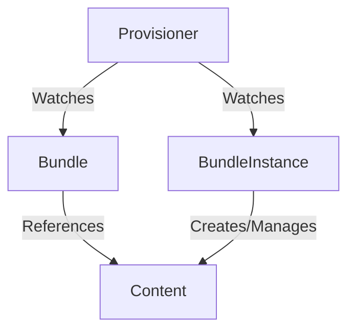

# Provisioners

The following subdirectories contain concrete Provisioner implementations.

- [plain](plain/README.md) - provisions `plain+v0` k8s bundles
- [registry](registry/README.md) - provisions `registry+v1` OLM bundles

## Global Provisioner Concepts

### Using provisioners to install bundle content
RukPak comes built-in with the concept of provisioners. Provisioners are pluggable controllers that understand how to unpack and install
`Bundle`s and `BundleInstance`s that specify they are in the provisioner's expected format.



Each provisioner has its own custom logic for how it goes about handling content. Using a specific provisioner is done by specifying the `provisionerClassName` property in the spec of either the `Bundle` or `BundleInstance` api. Here is an example of this concept in an embedded `BundleInstance`.

```yaml
apiVersion: core.rukpak.io/v1alpha1
kind: BundleInstance
metadata:
  name: my-bundle-instance
spec:
  provisionerClassName: core.rukpak.io/my-provisioner # <-- Provisioner for the BundleInstance
  template:
    metadata:
      labels:
        app: my-bundle
    spec:
      source:
        type: image
        image:
          ref: my-bundle@sha256:xyz123
      provisionerClassName: core.rukpak.io/my-provisioner # <-- Provisioner for the Bundle
```

### Pivoting between bundle versions

The `BundleInstance` API is meant to indicate the version of the bundle that should be active within the cluster.

Given an existing BundleInstance resource in the cluster, which contains an embedded Bundle template for the
`my-bundle-v0.0.1` bundle, you can modify the desired specification and a provisioner will automatically generate
a new `my-bundle-v0.0.2` Bundle matching that template.

When the new Bundle resource has been rolled out successfully, the old `my-bundle-v0.0.1` Bundle will be deleted from the cluster.

Provisioners also continually reconcile the created content via dynamic watches to ensure that all
resources referenced by the bundle are present on the cluster.

### Make bundle content available but do not install it

There is a natural separation between sourcing of the content and application of that content via two separate RukPak
APIs, `Bundle` and `BundleInstance`. A user can specify a particular `Bundle` to be available in the cluster for
inspection before any application of the resources. Given a `Bundle` resource named `my-bundle`, a provisioner
will pull down and unpack the bundle to a tar.gz file that is saved using the provisioner's internal storage mechanism.

By default, RukPak's built-in provisioners and other core resources are deployed into the `rukpak-system` namespace.

The content of a bundle can be queried using the `status.contentURL`, assuming you have the necessary
RBAC permissions to access bundle content.

As an example, a client outside the cluster can view the file contents from a bundle named `my-bundle` by running
the following script:

```bash
BUNDLE_NAME=my-bundle

kubectl create sa fetch-bundle -n default
kubectl create clusterrolebinding fetch-bundle --clusterrole=bundle-reader --serviceaccount=default:fetch-bundle
export TOKEN=$(kubectl get secret -n default $(kubectl get sa -n default fetch-bundle -o jsonpath='{.secrets[0].name}') -o jsonpath='{.data.token}' | base64 -d)
export URL=$(kubectl get bundle $BUNDLE_NAME -o jsonpath='{.status.contentURL}')
kubectl run -qit --rm -n default --restart=Never fetch-bundle --image=curlimages/curl --overrides='{ "spec": { "serviceAccount": "fetch-bundle" }  }' --command -- curl -sSLk -H "Authorization: Bearer $TOKEN" -o - $URL | tar ztv
kubectl delete clusterrolebinding fetch-bundle
kubectl delete sa fetch-bundle -n default
```

Simplifying the process of fetching this bundle content (e.g. via a plugin) is on the RukPak roadmap.

